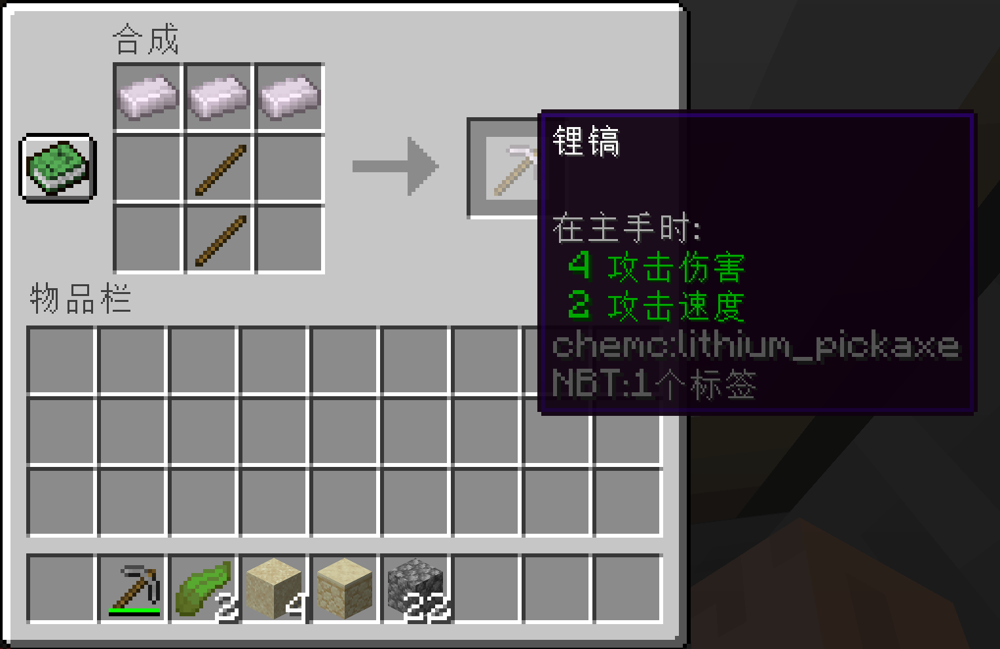

# chemc mod for Minecraft

This mod is still under heavy development.
Report bugs in the `issue` column if you notice them!

This will be a *VERY* scientific (compared to Minecraft itself and other mods like Alchemistry etc.) mod, that aims to be as scientific as possible. To give an example, lithium pickaxe would slowly convert into lithium oxide (which is poisonous) pickaxe and give you a poisoned effect.

Screenshot:

## TODO:
* Add everything before Calcium. (v0.1)
* Add LiOH, H2SO4, H3PO4, H3BO3, CO2, SO2, HF and SiO2. (v0.1.8)
* Add event for oxidation of the already-added alkali metals and the alkaline earths. (v0.2)
* Add Multiblock Reation Machinary. (v1.0)
* Add all halogens and alkali(ne) metals/earths. (v1.2)
* Add all non-radiocative metals and their oxides. (v2.0)
* Add all avaliable sulfate, hydroxide, carbonate, and phosphate (v2.4).